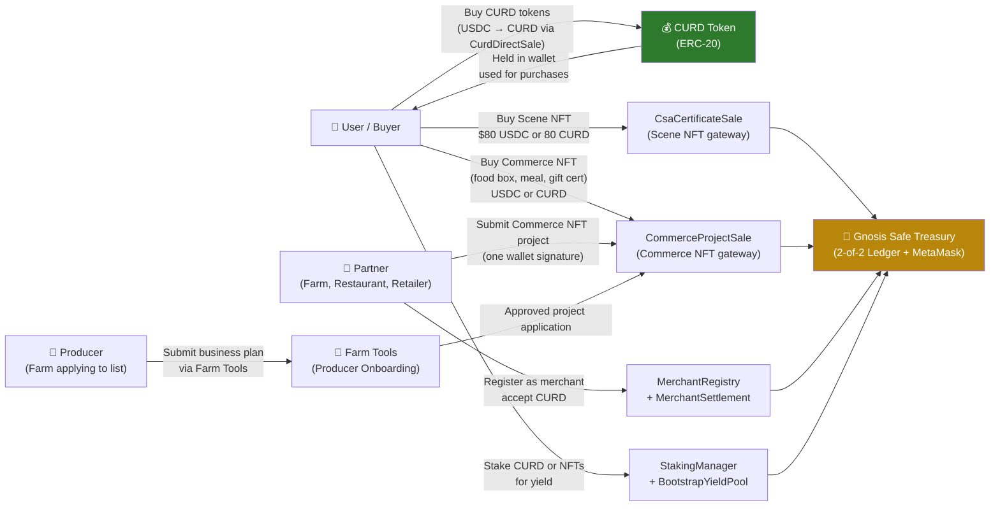
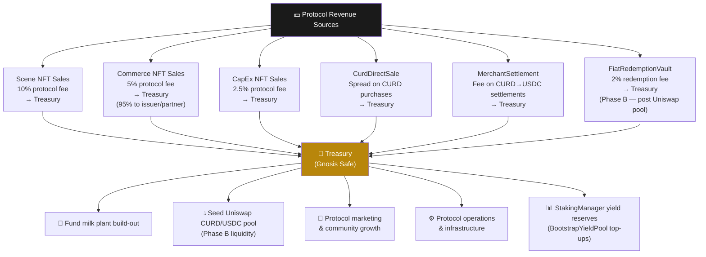
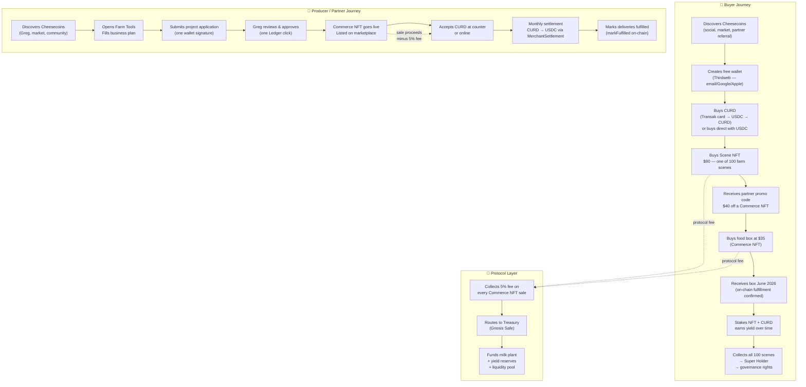
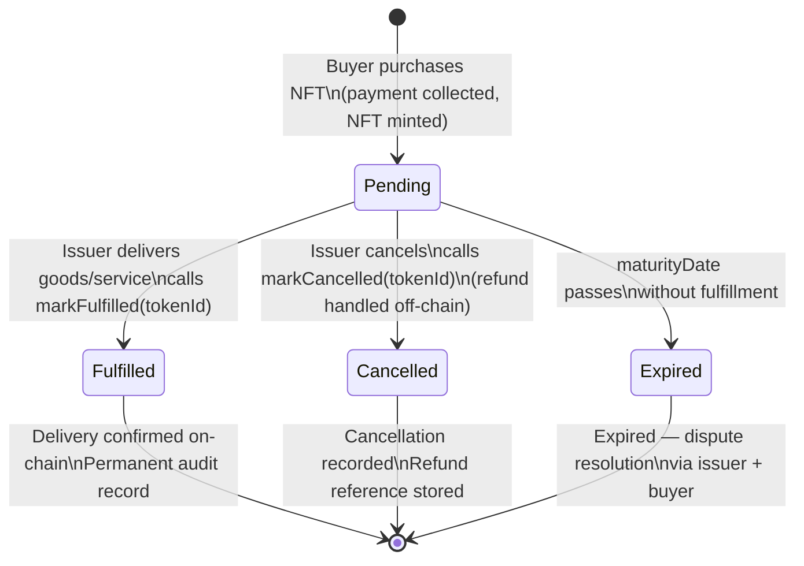
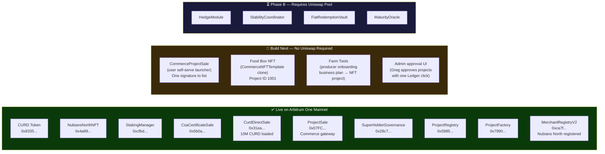

# Cheesecoins Ecosystem — Master Flowchart

> Renders in GitHub, VS Code with Mermaid extension, or any Mermaid viewer.
> This document covers: NFT classes, money inflows, products & rewards back to holders,
> and the protocol's revenue model.

---

## 1. NFT Class Taxonomy

Every NFT on the Cheesecoins protocol belongs to one of these classes.
Class determines: what the holder receives, whether they earn yield, and whether they earn governance rights.

```mermaid
graph TD
    ROOT["🧀 Cheesecoins Protocol NFTs"]

    ROOT --> SCENE["🌾 Scene NFT\n(Asset Class)"]
    ROOT --> COMMERCE["🛒 Commerce NFT\n(Forward Commitment Class)"]
    ROOT --> CAPEX["🏗️ CapEx NFT\n(Capital Class)"]
    ROOT --> INPUTCOST["🌱 Input Cost NFT\n(Operating Class)"]
    ROOT --> INNOVATION["💡 Innovation NFT\n(R&D Class)"]
    ROOT --> LAND["📋 Land Deed NFT\n(Land Class)"]

    SCENE --> SCENE1["Nubians North Collection\n100 scenes × 500 copies\n$80 USDC each\nGovernance + Staking"]

    COMMERCE --> C1["CSA Food Box\nPresale delivery commitment"]
    COMMERCE --> C2["Restaurant Meal\nRedeemable at partner location"]
    COMMERCE --> C3["Gift Certificate\n$X of farm products"]
    COMMERCE --> C4["Priority Purchase\nFirst dibs at locked price"]
    COMMERCE --> C5["Bulk Agreement\ne.g. 50 bales hay at set price"]
    COMMERCE --> C6["Service Commitment\ne.g. 20 hrs vet services"]
    COMMERCE --> C7["Processing Agreement\ne.g. process 50 pigs at $X each"]
    COMMERCE --> C8["Delivery Contract\ne.g. weekly milk to restaurant"]

    CAPEX --> CAP1["Equipment Financing\nTractor, milking system, etc."]
    CAPEX --> CAP2["Building Finance\nBarn, processing facility, greenhouse"]

    INPUTCOST --> IN1["Seasonal Operating Credit\nRenewable each season"]

    INNOVATION --> INN1["R&D Project\nFixed-term, non-renewable"]

    LAND --> L1["Fractional Land Rights\nSub-title NFTs on real parcels"]

    style SCENE fill:#1a5c2a,color:#fff
    style COMMERCE fill:#7c4d00,color:#fff
    style CAPEX fill:#1a3a5c,color:#fff
    style INPUTCOST fill:#3a1a5c,color:#fff
    style INNOVATION fill:#5c1a1a,color:#fff
    style LAND fill:#2a4a1a,color:#fff
```

---

## 2. Money Inflows — How Value Enters the Protocol

---

## 3. Products & Rewards — What Comes Back to Holders

```mermaid
graph TD
    HOLD["👛 NFT Holder"]

    HOLD --> |"Holds Scene NFT\n(Nubians North)"| SCENE_R["Scene NFT Returns"]
    HOLD --> |"Holds Commerce NFT\n(food box, meal, etc.)"| COMMERCE_R["Commerce NFT Returns"]
    HOLD --> |"Holds any staked NFT\nor CURD"| STAKING_R["Staking Returns"]
    HOLD --> |"Holds all 100 scenes\n= Super Holder"| GOV_R["Governance Returns"]

    SCENE_R --> SR1["📦 First access to\nmilk plant products\n(when plant opens)"]
    SCENE_R --> SR2["🎟️ Partner promo codes\n$40 off Commerce NFTs"]
    SCENE_R --> SR3["📈 Staking yield\n(CURD rewards)"]
    SCENE_R --> SR4["🏷️ Verified community\nmember status"]

    COMMERCE_R --> CR1["🥩 Physical delivery\n(food box shipped June 2026)"]
    COMMERCE_R --> CR2["🍽️ Meal redemption\n(show NFT at partner location)"]
    COMMERCE_R --> CR3["🎁 Gift cert redemption\n($X of farm products)"]
    COMMERCE_R --> CR4["✅ On-chain fulfillment record\n(issuer calls markFulfilled)"]

    STAKING_R --> ST1["💰 CURD yield\n(BootstrapYieldPool)"]
    STAKING_R --> ST2["📊 Governance weight\n(proportional to stake age)"]

    GOV_R --> GR1["🗳️ Propose protocol changes\n(after 24-week stake minimum)"]
    GOV_R --> GR2["⚖️ Vote on proposals"]
    GOV_R --> GR3["🔒 Execute via ProtocolTimelock\n(2-day delay on mainnet)"]

    style SCENE_R fill:#1a5c2a,color:#fff
    style COMMERCE_R fill:#7c4d00,color:#fff
    style STAKING_R fill:#1a3a5c,color:#fff
    style GOV_R fill:#4a1a5c,color:#fff
```

---

## 4. Protocol Revenue Model — How the Ecosystem Sustains Itself

---

## 5. Full Participant Journey — End to End

---

## 6. Commerce NFT — Lifecycle

A Commerce NFT is a **forward commitment**. The issuer (producer or partner) promises to deliver. The buyer holds the on-chain receipt.

---

## 7. Commerce NFT Subtypes — What Can Be Issued

Any approved partner can issue a Commerce NFT. The `instrumentSubtype` field defines what the holder receives.

| Subtype | Example | Issuer | Delivery |
|---|---|---|---|
| `csa_food_box` | Nubians North Meat & Cheese Box — June 2026 | Greg / Nubians North | Physical shipment |
| `restaurant_meal` | Dinner for two at partner restaurant | Restaurant partner | In-person redemption |
| `gift_certificate` | $100 of farm products | Any farm partner | In-store or shipped |
| `priority_purchase` | First 10 copies of spring cheese at $X | Fromagerie | Delivery or pickup |
| `bulk_agreement` | 50 bales hay at $8/bale | Feed farm | Scheduled delivery |
| `service_commitment` | 20 hours vet services at $90/hr | Vet practice | Booked appointments |
| `processing_agreement` | Process 50 pigs at $250 each | Abattoir | Scheduled processing |
| `delivery_contract` | Weekly 10L milk delivery to restaurant | Dairy farm | Weekly route |
| `loyalty_discount` | 15% off all purchases for 1 year | Retailer | Applied at checkout |
| `line_of_credit` | $5,000 input cost advance | Protocol / investor | Funds released to farmer |

---

## 8. Deployment State — What Is Live vs. Planned

---

*Last updated: April 2026*
*Owner: Greg Garner / Cheesecoins Protocol*
